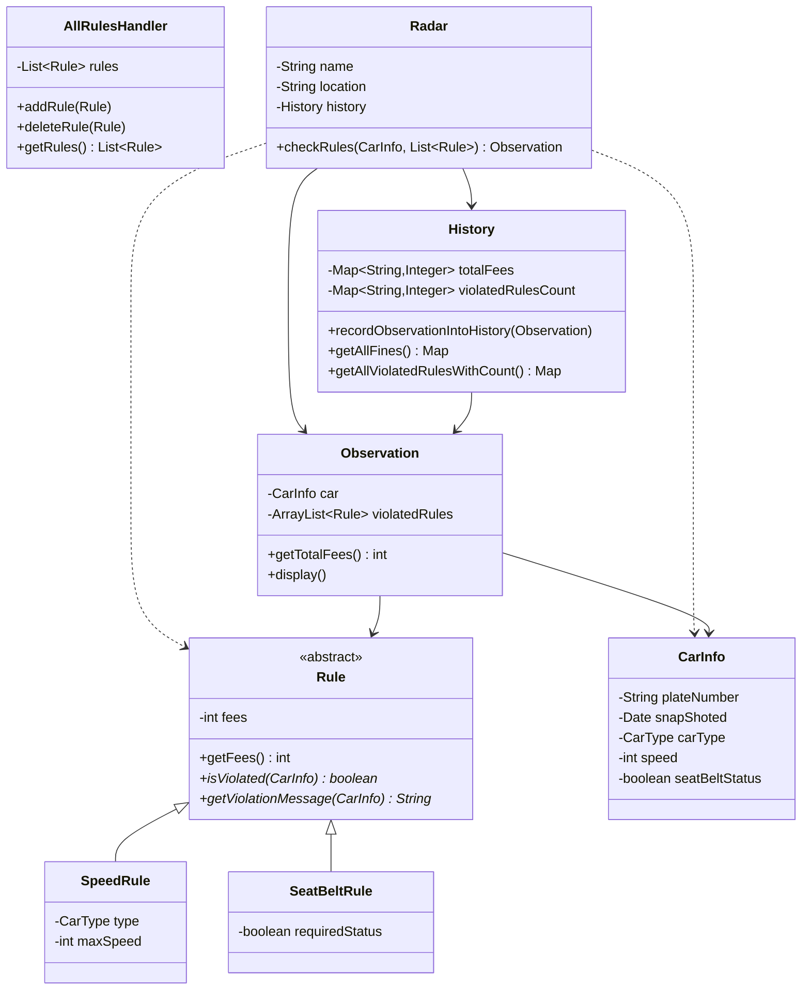

## 🎥 Brainstorming & Design Thinking
**Before writing any code, I first thought through the full design on a whiteboard.**
This video walks through that thinking process:

**[▶ Watch the brainstorming video](YOUR_VIDEO_LINK_HERE)**

---

## 💻 Code Walkthrough & Run Demo
**This video shows the final implementation, running it, and the output.**

**[▶ Watch the code & demo video](YOUR_VIDEO_LINK_HERE)**

---

## 🧩 UML Class Diagram

